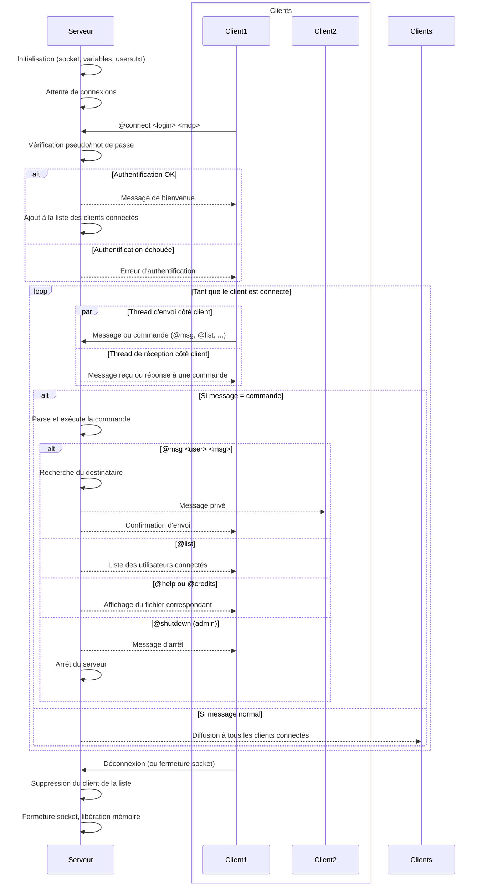

## Partie 2 : Système de commandes et gestion des utilisateurs

## Objectif :

Cette partie implémente une application de messagerie textuelle distante en C utilisant UDP, avec gestion multi-utilisateurs, authentification, commandes serveur et messages privés.

## Fonctionnalités principales :

- Authentification par pseudo et mot de passe (stockés dans users.txt)

- Commandes disponibles :
• @help : affiche l’aide utilisateur
• @ping : le serveur répond "pong"
• @msg <user> <msg> : message privé à un utilisateur
• @list : liste les utilisateurs connectés
• @credits : affiche les crédits de l’application
• @shutdown : arrête le serveur (admin uniquement)
• @connect <login> <mdp> : connexion utilisateur

- Gestion multi-clients (plusieurs clients connectés en même temps)

- Gestion des messages privés et de diffusion

- Arrêt propre du serveur via commande ou signal

## Fichiers importants :

• server.c : code du serveur UDP

• client.c : code du client UDP

• client_list.c/.h : gestion de la liste des clients connectés

• command.c/.h : parsing et gestion des commandes

• users.c/.h : gestion des utilisateurs et authentification

• users.txt : base des utilisateurs (pseudo motdepasse admin)

• help.txt : aide utilisateur

• credits.txt : crédits de l’application

## Compilation :
```
make
```
## Lancement :

Dans trois terminaux différents :

1-Serveur :
```
./server
```
2-Client1 : 
```
./client
```
3-Client2 : 
```
./client
```
## Utilisation :

- Saisir le pseudo et le mot de passe (doivent exister dans users.txt)
- Utiliser les commandes listées ci-dessus pour interagir avec le serveur et les autres clients

## Diagramme de séquence UML :


